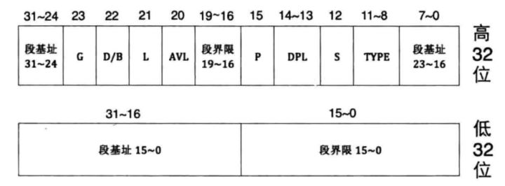

---
layout:	post
title:	操作系统设计与实现1
date: 2020-10-27
author: waynehao
---

>内心有一个声音在呐喊，要真的深入理解操作系统。
# 操作系统设计与实现1
## 操作系统概述
将从引导启动，内核层，应用层分别进行学习，完成一个基于Linux的，可在物理平台运行的操作系统。
## 环境搭建及基础知识
虚拟机Vmware用作编程环境，bochs虚拟机作为模拟硬件环境，其中会遇到一些错误，都可以很好百度解决。

Bootloader使用Intel格式汇编语言编写，NASM编译；内核及应用程序使用AT&T使用GAS编译。原因，Bootloader必须全部使用汇编写，Intel格式简洁；内核及应用程序只需要一小部分汇编，其他由GNC C语言编写，方便汇编与C的调试。

## bochs调试命令
```
b address
c 持续运行
s 单步
r 通用寄存器
sreg 段寄存器
xp /nuf addr 查看物理地址内容
x /nuf addr 查看线性地址内容
u start end 反汇编
````


还有些基础知识，比如内嵌汇编的属性特点啥的，不一一说了，等用到再细说。

## BootLoader
### 1.Boot
#### 1.1BIOS
BIOS自检后，将检测引导扇区，并将扇区的数据复制到内存中，处理器的执行权转移给这段数据（程序），即boot转移给Loader，后续则由编写的软件控制。

以软盘为例，BIOS自检后，会检查软盘的第0磁头第0磁道第1扇区是否以数值0x55和0xaa作为结尾判断引导扇区，进而复制到物理内存地址0x7c00处。

除此之外，`物理地址=CS<<4+IP`，CS是代码段寄存器，IP是指令指针寄存器，左移是二进制左移。

org伪指令`指示`编译器，将程序中所有内部地址引用增加一个段内偏移。

有关系统调用号这里不讲，开始贴初始Boot代码。

[boot.asm](../code/3/boot.asm)

加载loader程序，本操作系统选用FAT32文件系统装载Loader程序和内核程序，因此boot.asm涉及到FAT32磁盘扇区的读写操作，这里不做重点，不讲。只需要明白的是，通过该文件系统，可以准确的读取到loader程序并跳转执行。


记下几个点：1.bootloader中的操作都是直接操作物理地址的，因此org 0x7c00是指物理地址。2. 
~~我比较习惯先声明变量再引用，但发现其实asm可以先引用后再声明，如BootStartMessage。~~ 这里更正下，一定要把常量放在最后汇编代码的最后面，否则编译的时候会生成垃圾汇编指令。
3. $与$$，还有$-BootStartMessage。4.清屏的问题，留着后续有机会调试看看原因。5.关于字符串的偏移，调试时，如汇编mov bp, 27，这个27是字符串相对于段寄存器的偏移，其真实地址是 cs<<4 + off_set。

### 2.Loader
接下来控制权给了Loader，Loader引导加载程序的主线工作主要分为检测硬件信息，处理器模式转换，向内核传递数据等三部分工作。

[loader.asm](../code/3/loader.asm)

记下几个点：1.BIOS起初运行的是实模式，到32位使用的保护模式，到最后的IA-32e（长模式）。2.在实模式下，寻址上限是1MB，内核程序的临时转存空间是0x7e00，然后通过其他方法搬运到1MB以上的空间。3.本系统使用A20快速门打开1MB以上地址的开关，然后可通过FS寄存器的特殊寻址能力，可访问到1MB以上的空间。4.简单介绍下实模式和保护模式的[区别](https://zhuanlan.zhihu.com/p/42309472),此时CPU中除了*段寄存器*，都换成了32位寄存器。但注意的是，段寄存器存的不再是段基址了，此时关于内存段的限制信息存放在全局描述符表GDT的结构体，其中包含多个表项，每一个表项为段描述符，描述了段基址，界限，类型属性等。而段寄存器存放的是一个数组索引，可找到对应的表项。如图：

GDT存于内存中，GDTR（48位）寄存器存储GDT的内存地址及大小。在保护模式下，段寄存器存放的则是选择子。
4.模式转换的实现涉及很多段寄存器激活操作，这里不做关注。


